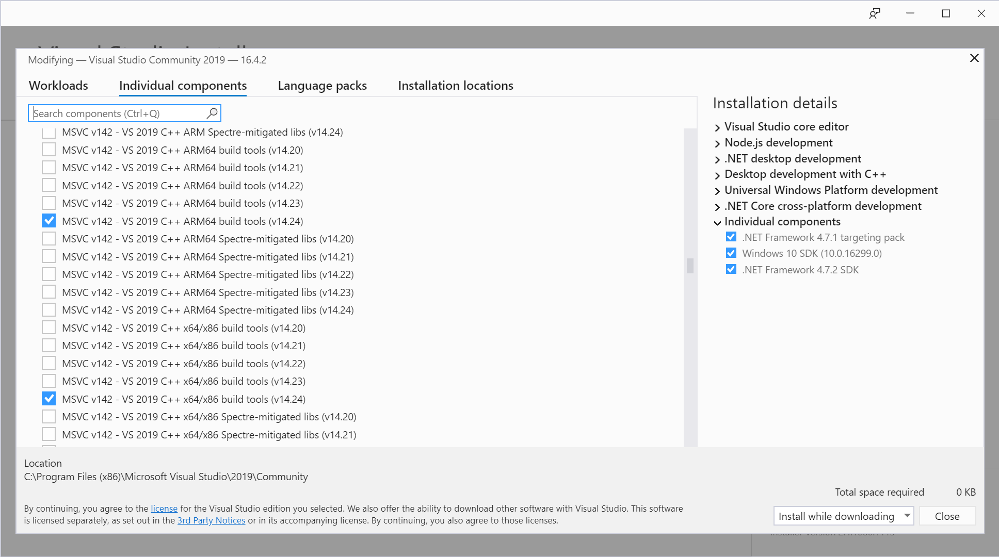

Building VSCode for Windows/ARM64
=================================

If you want a prebuilt binary archive: [VSCode-win32-arm64-1.41.1.zip](VSCode-win32-arm64-1.41.1.zip)

Prerequisites
-------------

* Install necessary tools to build VSCode. https://github.com/Microsoft/vscode/wiki/How-to-Contribute
* Install Visual Studio 2019 with C++ ARM64 build tools. Make sure it's checked in Visual Studio Installer -> Individual Components.
  * Maybe installing Build Tools for VS 2019 instead of full set of IDE is sufficient, but I've not tested that.



Node.js config
--------------

* Run following command in Command Prompt:

```
$ npm config set msvs_version 2019
$ npm config set python C:\Python27\python.exe
```

* Download node.lib from https://unofficial-builds.nodejs.org/download/release/v12.13.1/win-arm64/ and put it in `%LOCALAPPDATA%\node-gyp\Cache\<your-node-version>\arm64`.

Build
-----

We need patches to vscode and its dependency [vscode-node-sqlite3](https://github.com/microsoft/vscode-node-sqlite3/tree/vscode). So we need to clone both repositories and configure vscode to use locally cloned vscode-node-sqlite3 instead of the one in npm server.

All the necessary patches, including vscode-node-sqlite3 config stated above, are in following repos (my own forks, based on VSCode 1.41.1). You can either clone them, or manually apply those patches to your local source to, for example, build some newer version of VSCode.

* https://github.com/dsugiyama/vscode/commit/a6f446c307c124ed29979925eb19520d65b30640
* https://github.com/dsugiyama/vscode-node-sqlite3/commit/1e9ef3588fd3e1b91d39a08cd85b5c05968dfeb8

Assuming to use my forks, whole build steps are following (in Command Prompt):

```
$ git clone https://github.com/dsugiyama/vscode.git --branch 1.41-arm64
$ git clone https://github.com/dsugiyama/vscode-node-sqlite3.git --branch vscode-arm64

$ set npm_config_arch=arm64
$ "C:\Program Files (x86)\Microsoft Visual Studio\2019\Community\VC\Auxiliary\Build\vcvarsamd64_arm64.bat"

$ cd vscode
$ scripts\code.bat
$ yarn run gulp vscode-win32-arm64
$ yarn run gulp vscode-win32-arm64-archive
```

If everything works correctly, a binary archive is created in `.build\win32-arm64\archive`.
